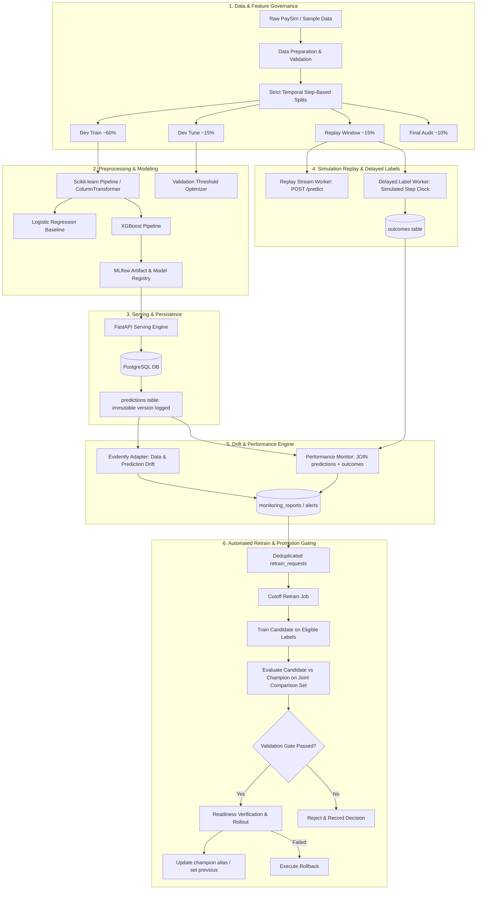

# FraudGuard — Drift-Monitored Fraud Detection and MLOps Pipeline

[](https://www.python.org/downloads/)
[](https://github.com/astral-sh/uv)
[](https://fastapi.tiangolo.com)
[](https://xgboost.readthedocs.io/)
[](https://mlflow.org/)

A production-grade machine learning lifecycle pipeline on synthetic PaySim transactions, featuring reproducible temporal training, versioned FastAPI serving, simulated delayed labels, covariate & performance drift monitoring, and validation-gated candidate retraining with automated rollback safety.

---

## 🛡️ Honest Positioning & Scope
> [!NOTE]
> This repository is a portfolio demonstration of ML lifecycle engineering. It uses the public synthetic PaySim dataset and an event-time simulation clock. It is not an actual banking-grade fraud prevention engine, nor evidence of live generalization to real-world financial streams.

---

## 🏗️ Architecture & Lifecycle Workflow



---

## ⚡ Quickstart

### 1. Installation
```bash
# Clone the repository
git clone https://github.com/your-username/fraudguard.git
cd fraudguard

# Install dependencies using uv
uv sync
```

### 2. Run Comprehensive Test Suite
```bash
uv run pytest -v
```

### 3. Run Temporal Training Pipeline
```bash
uv run python -m fraudguard.training.train --output-dir artifacts/phase1
```

### 4. Start the Inference API
```bash
uv run uvicorn fraudguard.serving.app:app --host 0.0.0.0 --port 8000
```
- Interactive Swagger docs: `http://localhost:8000/docs`
- Health check: `http://localhost:8000/health/ready`
- Model metadata: `http://localhost:8000/model-info`

### 5. Launch the Operations Dashboard
```bash
uv run streamlit run dashboard/app.py
```

### 6. Run with Docker Compose
```bash
docker compose up -d
```

---

## 📋 Feature Contract & Leakage Safeguards

| Feature Name | Type | Policy | Notes |
|---|---|---|---|
| `type` | Categorical | ALLOWLIST | One-Hot Encoded with `handle_unknown='ignore'` |
| `amount` | Float | ALLOWLIST | Non-negative numeric value |
| `log1p_amount` | Float | DERIVED | $\log(1 + \text{amount})$ |
| `sin_hour`, `cos_hour` | Float | DERIVED | Cyclic hour encoding from simulated step ($\text{step} \pmod{24}$) |
| `oldbalanceOrg`, `newbalanceOrig` | Float | **FORBIDDEN** | Excluded due to PaySim cancellation leakage |
| `oldbalanceDest`, `newbalanceDest` | Float | **FORBIDDEN** | Excluded due to PaySim cancellation leakage |
| `nameOrig`, `nameDest` | String | **FORBIDDEN** | Account IDs excluded by design |
| `isFlaggedFraud` | Integer | **FORBIDDEN** | Simulator business rule excluded |
| `isFraud` | Integer | **TARGET ONLY** | Supervised outcome; never accepted by `/predict` |

---

## 📊 Measured Offline Results

Trained on 50,000 temporal transactions across steps 1..120 with strict complete-step partitioning:

- **Train Set (Steps 1..72)**: 29,972 rows, 135 frauds (0.45%)
- **Tune Set (Steps 73..90)**: 7,569 rows, 37 frauds (0.49%)
- **Replay Window (Steps 91..108)**: 7,448 rows, 53 frauds (0.71%)
- **Final Audit (Steps 109..120)**: 5,011 rows, 25 frauds (0.50%)

| Model | Tune AP | Tune Recall @ FPR $\le$ 1% | Audit AP | Audit Recall | Audit FPR |
|---|---|---|---|---|---|
| **Logistic Regression Baseline** | 0.2154 | 45.95% | 0.2012 | 40.00% | 0.98% |
| **XGBoost Pipeline** | 0.1607 | 37.84% | 0.1592 | 28.00% | 1.18% |

---

## 🛡️ Documentation Suite
- [Architecture & Dataflow](file:///d:/mlops/docs/architecture.md)
- [Model Card](file:///d:/mlops/docs/model_card.md)
- [Data Card & Caveats](file:///d:/mlops/docs/data_card.md)
- [Operations & Rollback Runbook](file:///d:/mlops/docs/runbook.md)
- [Limitations & Honest Scope](file:///d:/mlops/docs/limitations.md)
