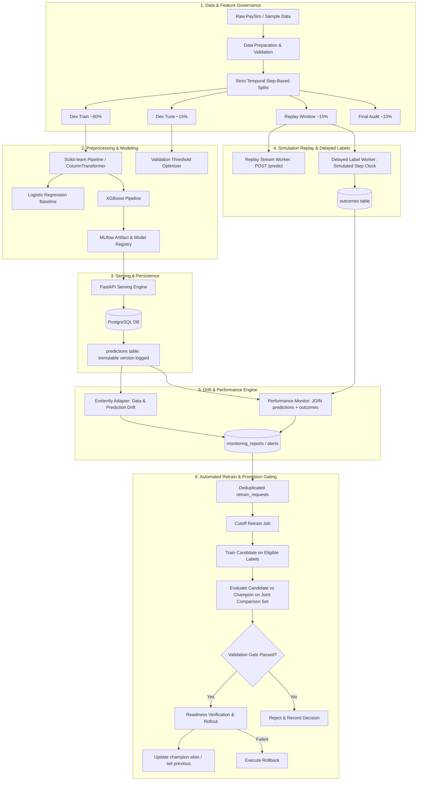

# FraudGuard System Architecture

## Overview
FraudGuard is an end-to-end MLOps pipeline and supervised classification service built to demonstrate the full lifecycle of machine learning systems under realistic production constraints:
- **Strict feature contracts and leakage prevention**
- **Disjoint temporal step-based partitioning**
- **Fail-closed inference auditing and idempotency**
- **Delayed outcome simulation via an event-time simulation clock**
- **Independent covariate drift and labeled performance monitoring**
- **Validation-gated candidate retraining, promotion, and automated rollback**

## High-Level Data Flow

## Database Tables
1. `predictions`: Primary inference audit table storing timestamp, simulated event step, allowlisted features, continuous risk score, threshold, decision, and immutable model version.
2. `outcomes`: Delayed ground truth labels associated via foreign key with the prediction.
3. `monitoring_reports`: Periodic window evaluations of feature PSI, Jensen-Shannon categorical divergence, and realized precision/recall/FPR.
4. `retrain_requests`: Deduplicated queue of automated retraining workflows triggered by sustained alerts.
5. `deployment_events`: Immutable audit trail recording every promotion attempt, readiness verification status, and rollback action.
